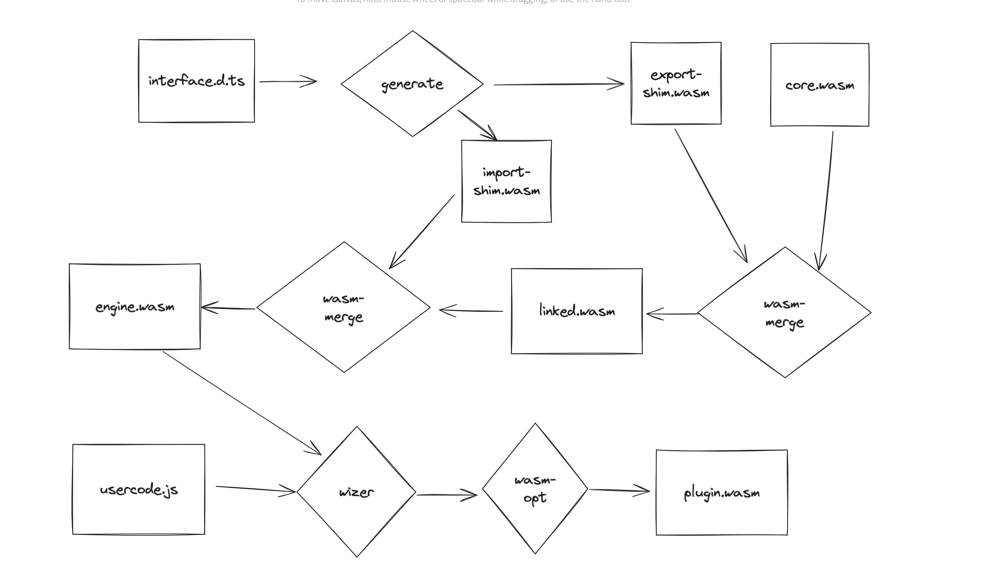

# JS-PDK Interface Defintion

## Purpose

We need to support host functions in the JS PDK but the current way we define
the interface, while working for exports, will not work for imports. Here is a rough
outline of how the current system works:

First we compile quickjs to wasm, we call this the "engine" or "core" module.
This module is a rust wasm app with quickjs embedded and has one custom function as an export `__invoke`.
`__invoke` takes an index (n), it looks at all the javascript exports in your main module, sorts them alphabetically,
then invokes the (nth) one.

The next step is to wizen and mutate this core module. The user passes in some javascript
which we eval and wizen. We need need to expose the exports in the export section. We do this
by evaling the js (in this compile step), reading the js module's exports, sorting them alphabetically,
and adding them to the exports table in order. The code for these functions (we call thunks) are also generated 
and just call `__invoke` with the export function id (where is sits in the order).

There are some downsides to doing this for exports, it's complicated and slow, but it also works fine.
This will not work for imports because we'd need to come up with a very wacky way to programatically extract
and type the imports from the user's js code. We can no longer magically assume we will know the wasm signature.
Exports are easy because all Extism exports have the same signature. Imports do not. Furthermore this process
of mutating a wasm module and adding some exports and functions works because it is a fairly additive process.
Importing on the other hand requires re-aligning a lot of other tables. And if i were to continue custom coding
that I'd be building a linker.

## Solution

What we need to start doing is have the programmer define for us their interface explicitly. They'll be able to
define the Exports and Imports in an IDL. We also need to use tooling to link the 
core module and the user code module so we don't fall down the trap of havign to build a linker.

Here is how I propose the new path will work. This may not be permanent but I think 
it will work for 1.0:



The programmer will define their interface in a typescript file `interface.d.ts`:

```typescript
// this interface is optional and types are  defined by you
// to match your host functions
declare module 'extism:host' {
  interface user {
    myHostFunction1(p: I32, q: I32): I32;
    myHostFunction2(p: I32): I64;
  }
}

// main is the plugin module
declare module 'main' {
  // all extism exports have type () -> i32
  export function greet(): I32;
}
```

Step 1 of the CLI will be to generate 2 shim modules `export-shim.wasm` and `import-shim.wasm` from this interface.
The export shim needs to generate some thunk functions as well as import `__invoke` from the core module (which gets
linked later in the pipeline). I spiked a working [prototype of this here](https://gist.github.com/bhelx/41fba8959fe7738a23cd750983341216).

`export-shim.wasm` will be linked with `core.wasm` using [wasm-merge](https://github.com/WebAssembly/binaryen#wasm-merge)
which is kind of like a linker but a little bit higher level. I may also consider using `wasm-ld`
but this seems to work for me and is flexible.

We then wasm-merge the import shim which gives us a unified interface for indirectly calling import functions.

Out of thhis merge comes the final module, but it's yet to be wizened. This is similar to the process
wer have now. We will run the module and eval the user's plugin js code in the egine. Then we freeze
and dump out to the final wasm after a few passes from wasm-opt.

### Rust to JS Bridge

Suppose we have 2 host functions and one export. The shim module that is generated
should look something like this (TODO this is still not accurate yet):

export-shim.wasm:

```wat
(module
  ; included by us for invoking the js runtime
  (import "coremod" "__invoke" (func (;0;) (type 0)))

  ; the generated thunk for the export
  (func (;1;) (type 0) (param i32) (result i32)
    local.get 0
    call 0)
  (export "myExport" (func 1)))
```

For exports, we can leave the behavior the same. For each export we will generate
a thunk function that calls `__invoke`.

For imports we have a bit of a challenge. The JS code, which is executed in the core
module, needs to be able to invoke these host functions.

The JS code (and underlying rust and c code) doesn't know about these functions, their names or their function
indexes at compile time. That's why the import shim will expose a call-indirect to the host functions.

TODO: this means all types need to be the same, perhaps we need to also expose the type parameter?

import-shim.wasm:

```wat
(module
  (type $int2int (func (param i32) (result i32)))

  (import "coremode" "myHostFunc1" (func $myHostFunc1 (type $int2int)))
  (import "coremode" "myHostFunc2" (func $myHostFunc2 (type $int2int)))

  (table 2 funcref)
  (elem (i32.const 0) $myHostFunc1 $myHostFunc2)

  (func $callHostFunc (type $int2int)
    local.get 0
    (call_indirect (type $int2int) (i32.const 0))
  )
  (export "__invokeHostFunc" (func $callHostFunc))
)
```

It exposes this indirect call with __invokeHostFunc which can be used by the
core quickjs engine module and invoked from javascript.

## Considerations

### WIT

I considered using WIT for the interface but:

1. Typescript is more natural to JS programmers
2. I believe the binding generators come with all the ABI stuff along with it

We can always add WIT support too and support both.

### wasm-merge vs wasm-ld (or normal linker)

TODO
